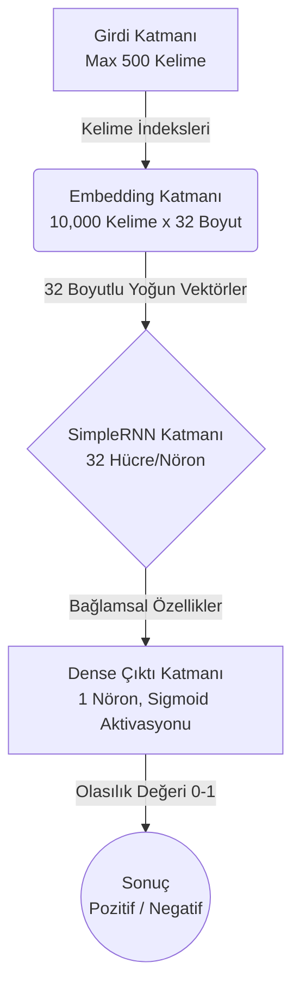

# RNN ile IMDB Duygu Analizi (Sentiment Analysis)

Bu proje, Keras ve TensorFlow kullanılarak IMDB film yorumları veri seti üzerinde geliştirilmiş bir Tekrarlayan Sinir Ağı (RNN) duygu analizi uygulamasıdır. Projenin temel amacı, verilen İngilizce bir metnin veya film yorumunun **Pozitif** (%50'den büyük) veya **Negatif** (%50'den küçük) duygu barındırdığını tespit etmektir.

## 🧠 Model Mimarisi

Model, metin dizilerini anlamlandırmak için sıralı verilerde (metin, zaman serisi vb.) güçlü olan RNN mimarisini kullanır.



### Katmanların İşlevleri:
1. **Embedding (Gömme) Katmanı:** Her bir kelimeyi 32 boyutlu anlamsal bir vektöre dönüştürür. Kelime sözlüğündeki en çok kullanılan 10.000 kelimeyi (`max_features`) destekler.
2. **SimpleRNN Katmanı:** Metni kelime kelime, sırasıyla işler. Önceki kelimelerin taşıdığı anlamı hücre durumunda (cell state) tutarak cümleyi bir bütün olarak analiz eder. 32 adet nörondan oluşur.
3. **Dense (Tam Bağlantılı) Katman:** `sigmoid` aktivasyon fonksiyonu kullanarak RNN'den gelen verileri tek bir olasılık değerine (0 ile 1 arasında) sıkıştırır.

## 🚀 Kurulum ve Çalıştırma

### Gereksinimler
Projeyi çalıştırmak için Python 3.x ve aşağıdaki kütüphanelerin sisteminizde yüklü olması gerekir.

```bash
pip install tensorflow numpy matplotlib nltk
```

### 1- Modeli Eğitmek (İsteğe Bağlı)
Kendi modelinizi eğitmek isterseniz `train_rnn_model.py` dosyasını çalıştırabilirsiniz. Bu işlem, IMDB veri setini indirecek, veriyi temizleyecek (stop_words vb.) ve modeli eğitecektir.
```bash
python train_rnn_model.py
```
*Bu işlemin sonunda `rnn_duygu_model.h5` isimli eğitilmiş model dosyası oluşacaktır.*

### 2- Yeni Yorumları Test Etmek (Kullanım)
Eğitilmiş model üzerinden yeni bir yoruma duygu testi yapmak için `predict_rnn_review.py` betiği kullanılır:
```bash
python predict_rnn_review.py
```
**Örnek Çıktı:**
```
Model yuklendi.
Bir film yorumu girin: I loved this movie, it was absolutely amazing and the acting was great!
Tahmin: Pozitif (Olasilik: 0.9412)
```

## 📖 RNN (Recurrent Neural Network) Çalışma Mantığı

Recurrent Neural Networks (Tekrarlayan Sinir Ağları), "hafızası" olan yapay sinir ağlarıdır. Geleneksel sinir ağları (Feed-Forward) bir girdiyi alır ve bir çıktı verir; metindeki bir önceki kelimenin bir sonraki kelimeyi nasıl etkilediğiyle ilgilenmez.

RNN ise **"Zaman Adımları" (Time-steps)** kullanır. Örneğin "Bu film çok güzel" cümlesini işlerken:
1. **Adım (t=1):** "Bu" kelimesi işlenir ve bir durum (state) oluşturulur.
2. **Adım (t=2):** "film" kelimesi işlenirken, sadece bu kelime değil aynı zamanda "Bu" kelimesinden gelen "durum bilgisi" de hesaba katılır.
3. **Adım (t=3):** "çok" kelimesi, "Bu film" bağlamıyla birlikte değerlendirilir.
4. **Adım (t=4):** "güzel" kelimesi işlendiğinde ağ, "Bu film çok güzel" cümlesinin bütüncül (pozitif) algısına ulaşmış olur.

Bu bağlamsal öğrenme yeteneği RNN'i, Makine Çevirisi, Otomatik Metin Tamamlama ve Duygu Analizi gibi Doğal Dil İşleme (NLP) projelerinde güçlü kılar. Bu projede de, film incelemelerindeki kelimelerin önceki kelimelerle ilişkisi kurularak yorumun bütününe dair bir "Duygu (Sentiment)" skoru çıkartılmaktadır.
